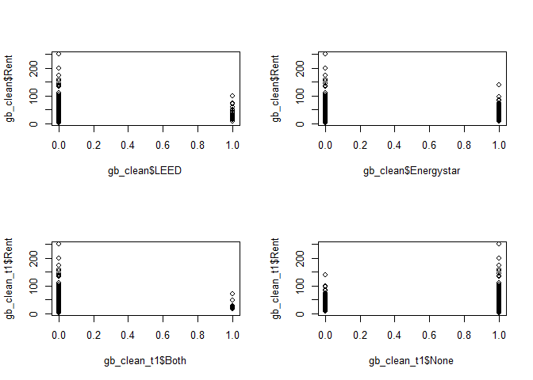
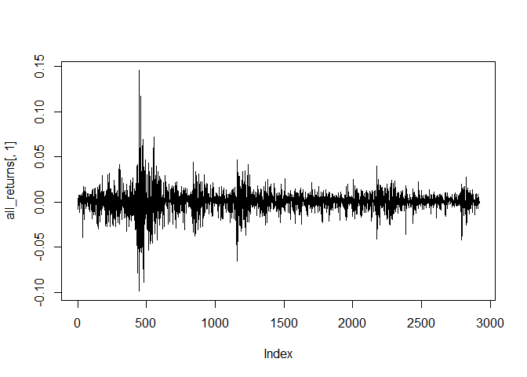
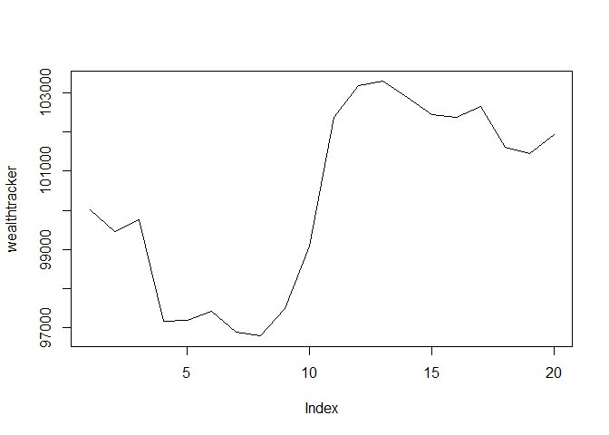

Probability practice
--------------------

### Part A.

**Visitors to your website are asked to answer a single survey question before they get access to the content on** **the page.** **Among all of the users, there are two categories: Random Clicker (RC), and Truthful Clicker (TC).** **There are two possible answers to the survey: yes and no. Random clickers would click either one with equal** **probability.** **You are also giving the information that the expected fraction of random clickers is 0.3.** **After a trial period, you get the following survey results: 65% said Yes and 35% said No.** **What fraction of people who are truthful clickers answered yes?**

#### *Answer:*

TC &lt;- Truthful Clicker RC &lt;- Random Clicker Y &lt;- Yes N &lt;- No

***Given:***

p(Y|RC) = p(N|RC) = 0.5

p(RC) = 0.3 , p(TC) = 0.7 , p(Y) = 0.65 , p(N) = 0.35

***Find out:***

P(Y|TC) = ?

***According to Baye's Theorem:*** p(x|y) = p(y|x)p(x)/p(y)

Therefore, p(Y|TC) = p(TC|Y)p(Y)/p(TC)

*Where:* p(TC|Y) = 1 - p(RC|Y)

p(RC|Y) = p(TC|Y)p(Y)/p(TC)

p(RC|Y) = (0.3 x 0.5) / 0.65 = 0.23

p(TC|Y) = 0.77

Therefore,

***p(Y|TC) = (0.77 x 0.65)/0.7 = 0.715***

------------------------------------------------------------------------

### Part B.

***Imagine a medical test for a disease with the following two attributes:*** ***The sensitivity is about 0.993. That is, if someone has the disease, there is a probability of 0.993 that*** ***they will test positive.*** ***The specificity is about 0.9999. This means that if someone doesn't have the disease, there is probability*** ***of 0.9999 that they will test negative.*** ***In the general population, incidence of the disease is reasonably rare: about 0.0025% of all people have it*** ***(or 0.000025 as a decimal probability).*** ***Suppose someone tests positive. What is the probability that they have the disease? In light of this*** ***calculation, do you envision any problems in implementing a universal testing policy for the disease?***

#### *Answer:*

P &lt;- Positive test

N &lt;- Negative Test

D &lt;- Disease

H &lt;- Healthy

***Given:***

p(P|D) = 0.993

p(N|H) = 0.9999

p(D) = 0.000025

***Find out:***

P(D|TP) = ?

***According to Baye's Theorem:*** p(x|y) = p(y|x)p(x)/p(y)

Therefore, p(D|P) = p(P|D)p(D)/p(P)

*Where:* p(P) = p(P|D)p(D) + p(P|H)p(H)

p(P|H) = 1- p(N|H)

Therefore, p(D|P) = p(P|D)p(D)/(p(P|D)p(D) + (1 - p(N|H))p(H))

***p(D|P) = (0.993 X 0.000025)/((0.993 X 0.000025) + ((1-0.9999)X(1 - 0.000025))) = 0.1988 ***

The probability of having a disease given you have tested positive is only 20% So even if you have tested positive for the disease there are 20% chances that you really have it.This is because the occurance of the disease is very rare. The problem with respect to implementing a universal testing policy for this disease will lead to occurance of more than 20% of false positive cases which can lead to uneccessary worry and medication amongst those who have tested positive.

Exploratory analysis: green buildings
-------------------------------------

First I will start preparing the data in hand.

\*\*\*Reading <Data:***>

``` r
green_buildings = read.csv("../data/green_buildings.csv")
```

***Cleaning :***

NAs present in empl\_gr. Will understand the distribution and carry out missing value treatment.

``` r
boxplot(green_buildings$empl_gr)
```


The distribution has less variance the missing value can be replaced with the mean

***Replacing NA's:***

``` r
gb_clean <- green_buildings
gb_clean$empl_gr[is.na(green_buildings$empl_gr)] <- mean(green_buildings$empl_gr)
```

*Looking at the leasing\_rate which even got the Excel guru's(EG) attention!*

EG removed entries which had leasing rates lower than 10% since he was unsure about these buildings

``` r
plot(gb_clean$green_rating,gb_clean$leasing_rate)
```


Looking at the plot above we can say that

*The entries with less than 10% of the leasing\_rate are mostly the non green buildings.* *Removing these rows is acceptable since we are planning to compare the non green withthe green buildings in the future where the later is concentrated around the higher leasing rate.* *Also, the concentration of the green rated building around the higher leasing rate margin indicates the better monetary performance of such buildings.* *Hence, the EG's decision was right!*

Removing the building entries with less than 10% of the leasing rate

``` r
gb_clean <-gb_clean[which(gb_clean$leasing_rate > 10),]
```

***Hypothesis*** : Most green buildings are young hence the rent will be higher

***Looking at relationship between age and green\_rating***

*On running a chi square test(p-value&lt;2.2e-16) and plotting the relationship between age and green status we can see that green rating buildings have a lower age since it's a recent concept.* *Hence, if the building has a green status we can automatically assume that it is a young building, making age a confounding variable.*

``` r
plot(gb_clean$green_rating,gb_clean$age)
```


``` r
chisq.test(gb_clean$green_rating,gb_clean$age)
```

    ## Warning in chisq.test(gb_clean$green_rating, gb_clean$age): Chi-squared
    ## approximation may be incorrect

    ## 
    ##  Pearson's Chi-squared test
    ## 
    ## data:  gb_clean$green_rating and gb_clean$age
    ## X-squared = 666.32, df = 143, p-value < 2.2e-16

***Looking at the relationship between age and Rent***

We can say that they are not very strongly correlated(-0.103)

``` r
#Splitting buildings into green and non green
gb_green <- gb_clean[which(gb_clean$green_rating == 1),]
gb_not_green <- gb_clean[which(gb_clean$green_rating == 0),]
a <- nrow(gb_green[which(gb_green$age > 50),])
b <- nrow(gb_green[which(gb_green$age < 50),])
a/b
```

    ## [1] 0.04109589

Only 4% of the green buildings are old

``` r
c <- nrow(gb_not_green[which(gb_not_green$age > 50),])
d <- nrow(gb_not_green[which(gb_not_green$age < 50),])
c/d
```

    ## [1] 0.5712992

58% of non green buildings are older than 50 years

We can see that as the age is increasing the rent is increasing

``` r
plot(gb_clean$Rent,gb_clean$age)
```


*However,we can see that the green buildings are younger and tend to cost more.Hence age is a confounding variable between the relationship.* *Hence,the hypothesis that since green buildings are young the rent will be higher is approved!*

***Hypothesis***: Having both green\_rating will have higher rent

Looking at the plots generate we can say that the buildings with both the LEED and Energy certification tend to have lower rents, which is surprising! Also,the rent for the green certified building lies mostly within 100

``` r
#Identifying buildings with both and none of the certificates
par(mfrow=c(2,2))
gb_clean_t1 <- gb_clean
gb_clean_t1$Both <-0
gb_clean_t1$Both[gb_clean_t1$LEED == 1 & gb_clean_t1$Energystar == 1] <-1
gb_clean_t1$None <-0
gb_clean_t1$None[gb_clean_t1$LEED == 0 & gb_clean_t1$Energystar== 0] <-1

nrow(gb_clean[which(gb_clean$LEED ==1),])
```

    ## [1] 54

``` r
nrow(gb_clean[which(gb_clean$Energystar ==1),])
```

    ## [1] 637

``` r
nrow(gb_clean_t1[which(gb_clean_t1$Both ==1),])
```

    ## [1] 7

``` r
par(mfrow=c(2,2))
plot(gb_clean$LEED,gb_clean$Rent)
plot(gb_clean$Energystar,gb_clean$Rent)
plot(gb_clean_t1$Both,gb_clean_t1$Rent)
plot(gb_clean_t1$None,gb_clean_t1$Rent)
```



*Hence, the Hypothesis above is rejected!*

***Hypothesis***: Green buildings are usually class a buildings hence will have a higher rent

***Looking at classes of the building***

``` r
nrow(gb_green[which(gb_green$class_a == 1),])
```

    ## [1] 546

``` r
nrow(gb_green[which(gb_green$class_b == 1),])
```

    ## [1] 131

``` r
nrow(gb_green)
```

    ## [1] 684

Around 80% of the green buildings are class a and the remaining are class b and c

Class a buildings tend to have a higher rent in comparison to the other classes thereby indicating that the class maybe a confounding variable in the relationship between Rent and green rating.

*Hypothesis that green buildings are usually class a and hence will lead to increase in rent is approved!*

***Hypothesis***: Increase in cooling degree increase rent for green buildings

*From the below plots we can see that as the cooling degrees tends to increase the rent goes down for green buildings.* *The same occurs with non green buildings thereby not providing any substantial insight.* *Hence hypothesis is rejected!*

``` r
par(mfrow=c(2,2))
plot(gb_green$hd_total07,gb_green$Rent)
plot(gb_green$cd_total_07,gb_green$Rent)
plot(gb_not_green$hd_total07,gb_not_green$Rent)
plot(gb_not_green$cd_total_07,gb_not_green$Rent)
```


After understanding the important variables involved in data it looks like the Excel guru seems to have got it right till now. But... *The excel guru considered 27.6 per square foot per year.However, since the size is going to be around 250k one should choose the median of the rent of buildings around that size.*

``` r
green <- gb_green[which(gb_green$size >= 248000 & gb_green$size >= 252000),]
median(green$Rent)
```

    ## [1] 26.82

``` r
not_green <- gb_not_green[which(gb_green$size >= 248000 & gb_green$size >= 252000),]
median(not_green$Rent)
```

    ## [1] 26.59

The difference obtained is 0.13 which is very low and would lead to one making revenue after more than 30 years *Thereby proving EG wrong.*

***Let us try to incorporate the stories of the building into our analysis***

``` r
median(green$leasing_rate) #The median occupancy rate for such buildings is around 94%
```

    ## [1] 93.79

``` r
green_stories <- gb_green[which(gb_green$stories>=13 & gb_green$stories <=17),]
median(green_stories$Rent)
```

    ## [1] 28.66

``` r
green_not_stories <- gb_not_green[which(gb_not_green$stories>=13 & gb_not_green$stories <=17),]
median(green_not_stories$Rent)
```

    ## [1] 25.77

***On looking at stories along with size a margin of 2.89 was obtained which is larger than the one stated by EG!*** ***Hence, on building a 13 to 14 storey building with a size of 248k to 252k square foot the estimations and suggestions made by the EG are right if not very accurate. Thus,building a green building will be good idea!***

### Bootstrapping

***Part A: the even split: 20% of your assets in each of the five ETFs***

    ## Loading required package: dplyr

    ## 
    ## Attaching package: 'dplyr'

    ## The following objects are masked from 'package:stats':
    ## 
    ##     filter, lag

    ## The following objects are masked from 'package:base':
    ## 
    ##     intersect, setdiff, setequal, union

    ## Loading required package: lattice

    ## Loading required package: ggformula

    ## Loading required package: ggplot2

    ## Loading required package: ggstance

    ## 
    ## Attaching package: 'ggstance'

    ## The following objects are masked from 'package:ggplot2':
    ## 
    ##     geom_errorbarh, GeomErrorbarh

    ## 
    ## New to ggformula?  Try the tutorials: 
    ##  learnr::run_tutorial("introduction", package = "ggformula")
    ##  learnr::run_tutorial("refining", package = "ggformula")

    ## Loading required package: mosaicData

    ## Loading required package: Matrix

    ## 
    ## The 'mosaic' package masks several functions from core packages in order to add 
    ## additional features.  The original behavior of these functions should not be affected by this.
    ## 
    ## Note: If you use the Matrix package, be sure to load it BEFORE loading mosaic.

    ## 
    ## Attaching package: 'mosaic'

    ## The following object is masked from 'package:Matrix':
    ## 
    ##     mean

    ## The following object is masked from 'package:ggplot2':
    ## 
    ##     stat

    ## The following objects are masked from 'package:dplyr':
    ## 
    ##     count, do, tally

    ## The following objects are masked from 'package:stats':
    ## 
    ##     binom.test, cor, cor.test, cov, fivenum, IQR, median,
    ##     prop.test, quantile, sd, t.test, var

    ## The following objects are masked from 'package:base':
    ## 
    ##     max, mean, min, prod, range, sample, sum

    ## Loading required package: xts

    ## Loading required package: zoo

    ## 
    ## Attaching package: 'zoo'

    ## The following objects are masked from 'package:base':
    ## 
    ##     as.Date, as.Date.numeric

    ## 
    ## Attaching package: 'xts'

    ## The following objects are masked from 'package:dplyr':
    ## 
    ##     first, last

    ## Loading required package: TTR

    ## Version 0.4-0 included new data defaults. See ?getSymbols.

    ## 'getSymbols' currently uses auto.assign=TRUE by default, but will
    ## use auto.assign=FALSE in 0.5-0. You will still be able to use
    ## 'loadSymbols' to automatically load data. getOption("getSymbols.env")
    ## and getOption("getSymbols.auto.assign") will still be checked for
    ## alternate defaults.
    ## 
    ## This message is shown once per session and may be disabled by setting 
    ## options("getSymbols.warning4.0"=FALSE). See ?getSymbols for details.

    ## 
    ## WARNING: There have been significant changes to Yahoo Finance data.
    ## Please see the Warning section of '?getSymbols.yahoo' for details.
    ## 
    ## This message is shown once per session and may be disabled by setting
    ## options("getSymbols.yahoo.warning"=FALSE).

    ## [1] "SPY" "TLT" "LQD" "EEM" "VNQ"

``` r
# Adjust for splits and dividends
SPYa = adjustOHLC(SPY)
TLTa = adjustOHLC(TLT)
LQDa = adjustOHLC(LQD)
EEMa = adjustOHLC(EEM)
VNQa = adjustOHLC(VNQ)

# Look at close-to-close changes
par(mfrow=c(3,2))
plot(ClCl(SPYa))
plot(ClCl(TLTa))
plot(ClCl(LQDa))
plot(ClCl(EEMa))
plot(ClCl(VNQa))
# Combine close to close changes in a single matrix
all_returns = cbind(ClCl(SPYa),ClCl(TLTa),ClCl(LQDa),ClCl(EEMa),ClCl(VNQa))
all_returns = as.matrix(na.omit(all_returns))
```


``` r
# These returns can be viewed as draws from the joint distribution
pairs(all_returns)
```


``` r
plot(all_returns[,1], type='l')
```



``` r
# Look at the US domestic equities over time
plot(all_returns[,5], type='l')
```


``` r
# An autocorrelation plot: nothing there
acf(all_returns[,5])
```


``` r
# The sample correlation matrix
cor(all_returns)
```

    ##            ClCl.SPYa  ClCl.TLTa  ClCl.LQDa   ClCl.EEMa   ClCl.VNQa
    ## ClCl.SPYa  1.0000000 -0.4361864 0.10138038  0.40655931  0.76825388
    ## ClCl.TLTa -0.4361864  1.0000000 0.43228418 -0.16741492 -0.25339288
    ## ClCl.LQDa  0.1013804  0.4322842 1.00000000  0.08796019  0.07150394
    ## ClCl.EEMa  0.4065593 -0.1674149 0.08796019  1.00000000  0.29231279
    ## ClCl.VNQa  0.7682539 -0.2533929 0.07150394  0.29231279  1.00000000

``` r
# The sample correlation matrix
cor(all_returns)
```

    ##            ClCl.SPYa  ClCl.TLTa  ClCl.LQDa   ClCl.EEMa   ClCl.VNQa
    ## ClCl.SPYa  1.0000000 -0.4361864 0.10138038  0.40655931  0.76825388
    ## ClCl.TLTa -0.4361864  1.0000000 0.43228418 -0.16741492 -0.25339288
    ## ClCl.LQDa  0.1013804  0.4322842 1.00000000  0.08796019  0.07150394
    ## ClCl.EEMa  0.4065593 -0.1674149 0.08796019  1.00000000  0.29231279
    ## ClCl.VNQa  0.7682539 -0.2533929 0.07150394  0.29231279  1.00000000

``` r
myprices = getSymbols(mystocks, from = "2007-01-01")
# A chunk of code for adjusting all stocks
# creates a new object addind 'a' to the end
# For example, WMT becomes WMTa, etc
for(ticker in mystocks) {
  expr = paste0(ticker, "a = adjustOHLC(", ticker, ")")
  eval(parse(text=expr))
}
# Combine all the returns in a matrix
all_returns = cbind(    ClCl(SPYa),
                     ClCl(TLTa),
                     ClCl(LQDa),
                     ClCl(EEMa),
                     ClCl(VNQa))
all_returns = as.matrix(na.omit(all_returns))

# Compute the returns from the closing prices
pairs(all_returns)
```


``` r
# Sample a random return from the empirical joint distribution
# This simulates a random day
return.today = resample(all_returns, 1, orig.ids=FALSE)
```

``` r
# Sample a random return from the empirical joint distribution
# This simulates a random day
set.seed(1)
return.today = resample(all_returns, 1, orig.ids=FALSE)

# Update the value of your holdings
# Assumes an equal allocation to each asset
total_wealth = 100000
my_weights = c(0.2,0.2,0.2, 0.2, 0.2)
holdings = total_wealth*my_weights
holdings = holdings*(1 + return.today)

# Compute your new total wealth
total_wealth = sum(holdings)

# Now loop over four trading weeks
total_wealth = 100000
weights = c(0.2, 0.2, 0.2, 0.2, 0.2)
holdings = weights * total_wealth
n_days = 20
wealthtracker = rep(0, n_days) # Set up a placeholder to track total wealth
for(today in 1:n_days) {
  return.today = resample(all_returns, 1, orig.ids=FALSE)
  holdings = holdings + holdings*return.today
  total_wealth = sum(holdings)
  holdings = weights * total_wealth
  wealthtracker[today] = total_wealth
}
total_wealth
```

    ## [1] 101927

``` r
plot(wealthtracker, type='l')
```



``` r
# Now simulate many different possible scenarios  
initial_wealth = 100000
sim1 = foreach(i=1:5000, .combine='rbind') %do% {
  total_wealth = initial_wealth
  holdings = weights * total_wealth
  n_days = 20
  wealthtracker = rep(0, n_days)
  for(today in 1:n_days) {
    return.today = resample(all_returns, 1, orig.ids=FALSE)
    holdings = holdings + holdings*return.today
    total_wealth = sum(holdings)
    holdings = weights * total_wealth
    wealthtracker[today] = total_wealth
  }
  wealthtracker
}
```

``` r
hist(sim1[,n_days], 25)
```


``` r
#Profit/Loss
hist(sim1[,n_days]- initial_wealth, breaks=30)
```


Calculate 5% value at risk

``` r
e_1 = quantile(sim1[,n_days], 0.05) - initial_wealth
```

***Part B: Safer splits ***

``` r
par(mfrow=c(3,2))
plot(ClCl(SPYa))
plot(ClCl(TLTa))
plot(ClCl(VNQa))
plot(ClCl(LQDa))
plot(ClCl(EEMa))
```


``` r
sd(all_returns[,1]) #SPY
```

    ## [1] 0.01244844

``` r
sd(all_returns[,2]) #EEM
```

    ## [1] 0.009156927

``` r
sd(all_returns[,3]) #TLT
```

    ## [1] 0.005219542

``` r
sd(all_returns[,4]) #LDQ
```

    ## [1] 0.04024071

``` r
sd(all_returns[,5]) #VNQ
```

    ## [1] 0.02115977

***Outline your choice of the "safe" and "aggressive" portfolios:*** *Looking at the plots and the standard deviation claculated one can say that the more dynamic stocks are EEM and VNQ.* *These will be considered as the aggressive stocks * *The other 3 i.e. SPY,TLT and LQD do not fluctuate as much as the others hence are considered are safer.*

*So considering 4 combinations of the safer and aggressive stocks with more focus(inc weights) on the safer stocks.* ***1. TLT(0.33), LDQ(0.33) ,SPY(0.34)***

``` r
mystocks = c("TLT", "LQD","SPY")
getSymbols(mystocks)
```

    ## [1] "TLT" "LQD" "SPY"

``` r
# Adjust for splits and dividends

TLTa = adjustOHLC(TLT)
LQDa = adjustOHLC(LQD)
VNQa = adjustOHLC(SPY)

# Combine close to close changes in a single matrix
all_returns = cbind(ClCl(TLTa),ClCl(LQDa),ClCl(SPYa))
all_returns = as.matrix(na.omit(all_returns))

myprices = getSymbols(mystocks, from = "2007-01-01")

# A chunk of code for adjusting all stocks;creates a new object addind 'a' to the end;For example, WMT becomes WMTa, etc
for(ticker in mystocks) {
  expr = paste0(ticker, "a = adjustOHLC(", ticker, ")")
  eval(parse(text=expr))
}

# Combine all the returns in a matrix
all_returns = cbind( ClCl(TLTa),
                     ClCl(LQDa),
                     ClCl(SPYa))
all_returns = as.matrix(na.omit(all_returns))

# Sample a random return from the empirical joint distribution
set.seed(1)
# This simulates a random day
return.today = resample(all_returns, 1, orig.ids=FALSE)

# Simulating many different possible scenarios  
initial_wealth = 100000
sim1 = foreach(i=1:5000, .combine='rbind') %do% {
  total_wealth = initial_wealth
  weights = c(0.33,0.33,0.34)
  holdings = weights * total_wealth
  n_days = 20
  wealthtracker = rep(0, n_days)
  for(today in 1:n_days) {
    return.today = resample(all_returns, 1, orig.ids=FALSE)
    holdings = holdings + holdings*return.today
    total_wealth = sum(holdings)
    holdings = weights * total_wealth
    wealthtracker[today] = total_wealth
  }
  wealthtracker
}

par(mfrow=c(1,2))
hist(sim1[,n_days], 25)
hist(sim1[,n_days]- initial_wealth, breaks=30)
```


``` r
# Calculate 5% value at risk
s_q1 = quantile(sim1[,n_days], 0.05) - initial_wealth #-3030.64
```

***2. TLT(0.5), LDQ(0.3) ,SPY(0.2)***

``` r
# Simulating many different possible scenarios  
initial_wealth = 100000
sim1 = foreach(i=1:5000, .combine='rbind') %do% {
  total_wealth = initial_wealth
  weights = c(0.5,0.3,0.2)
  holdings = weights * total_wealth
  n_days = 20
  wealthtracker = rep(0, n_days)
  for(today in 1:n_days) {
    return.today = resample(all_returns, 1, orig.ids=FALSE)
    holdings = holdings + holdings*return.today
    total_wealth = sum(holdings)
    holdings = weights * total_wealth
    wealthtracker[today] = total_wealth
  }
  wealthtracker
}
par(mfrow=c(1,2))
head(sim1)
```

    ##              [,1]     [,2]     [,3]      [,4]     [,5]     [,6]     [,7]
    ## result.1 100226.0 100158.0 100454.7 100796.93 101089.6 101021.6 101412.4
    ## result.2 100195.4  99841.8  99592.7  99927.15 100097.8 100393.9 100702.3
    ## result.3 100086.9 100710.1 100794.2 100984.32 101539.4 102462.0 102739.3
    ## result.4 100024.9 100167.8 100211.5 100294.40 100565.2 100839.5 101596.5
    ## result.5 100681.1 100664.3 101996.7 101588.82 101572.8 101336.2 102359.3
    ## result.6 100220.1 100345.8 101125.8 101619.37 101476.4 101748.0 101553.0
    ##              [,8]     [,9]    [,10]     [,11]     [,12]     [,13]
    ## result.1 101779.0 101750.6 101607.0 101762.50 101256.46 101304.29
    ## result.2 100755.0 100399.8 100488.4 100424.14 100317.34 100809.70
    ## result.3 102580.8 102608.8 103011.5 102848.07 102728.31 102207.35
    ## result.4 101069.0 100899.5 100405.7 100776.79 100605.56 100945.48
    ## result.5 100906.2 100787.7  99340.3  99767.68  99220.75  99508.13
    ## result.6 101295.1 101481.0 100950.3 101683.94 101134.76 100713.58
    ##              [,14]     [,15]     [,16]     [,17]     [,18]     [,19]
    ## result.1 102179.91 102108.22 101808.63 101980.56 100667.58 100871.30
    ## result.2  99919.64  99984.97 100688.15 100688.04 100640.36 101547.88
    ## result.3 101753.35 101915.32 102421.22 102483.03 101939.57 102130.69
    ## result.4 101742.99 101867.28 102002.10 102004.54 101759.25 102019.85
    ## result.5  99703.77  99199.11  98395.81  98067.92  98511.63  98547.54
    ## result.6 100728.97 100880.56 100687.24 100739.00 100277.83 100112.43
    ##              [,20]
    ## result.1 101091.03
    ## result.2 101770.42
    ## result.3 102285.70
    ## result.4 102321.34
    ## result.5  98685.59
    ## result.6 100043.11

``` r
hist(sim1[,n_days], 25)

# Profit/loss
mean(sim1[,n_days])
```

    ## [1] 100533.2

``` r
hist(sim1[,n_days]- initial_wealth, breaks=30)
```


``` r
# Calculate 5% value at risk
s_q2 = quantile(sim1[,n_days], 0.05) - initial_wealth #-3206.11
```

***3. VNQ(0.05),EEM(0.05),TLT(0.4), LDQ(0.3) ,SPY(0.2)***

``` r
mystocks = c("VNQ","EEM","TLT","LQD", "SPY")
myprices = getSymbols(mystocks, from = "2007-01-01")

SPYa = adjustOHLC(SPY)
TLTa = adjustOHLC(TLT)
LQDa = adjustOHLC(LQD)
EEMa = adjustOHLC(EEM)
VNQa = adjustOHLC(VNQ)

# A chunk of code for adjusting all stocks
# creates a new object addind 'a' to the end
# For example, WMT becomes WMTa, etc
for(ticker in mystocks) {
  expr = paste0(ticker, "a = adjustOHLC(", ticker, ")")
  eval(parse(text=expr))
}

par(mfrow=c(1,2))
# Combine all the returns in a matrix
all_returns = cbind( ClCl(VNQa),
                     ClCl(EEMa),
                     ClCl(TLTa),
                     ClCl(LQDa),
                     ClCl(SPYa))

all_returns = as.matrix(na.omit(all_returns))

# Compute the returns from the closing prices
pairs(all_returns)
```


``` r
# Sample a random return from the empirical joint distribution
# This simulates a random day
return.today = resample(all_returns, 1, orig.ids=FALSE)

# Now simulate many different possible scenarios  
initial_wealth = 100000
sim1 = foreach(i=1:5000, .combine='rbind') %do% {
  total_wealth = initial_wealth
  weights = c(0.05,0.05,0.4,0.3,0.2)
  holdings = weights * total_wealth
  n_days = 20
  wealthtracker = rep(0, n_days)
  for(today in 1:n_days) {
    return.today = resample(all_returns, 1, orig.ids=FALSE)
    holdings = holdings + holdings*return.today
    total_wealth = sum(holdings)
    holdings = weights * total_wealth
    wealthtracker[today] = total_wealth
  }
  wealthtracker
}

hist(sim1[,n_days], 25)

# Profit/loss
hist(sim1[,n_days]- initial_wealth, breaks=30)
```


``` r
# Calculate 5% value at risk
s_q3 = quantile(sim1[,n_days], 0.05) - initial_wealth #-3166.62
```

***4. VNQ(0.1),EEM(0.1),TLT(0.35), LDQ(0.25) ,SPY(0.2)***

``` r
initial_wealth = 100000
sim1 = foreach(i=1:5000, .combine='rbind') %do% {
  total_wealth = initial_wealth
  weights = c(0.1,0.1,0.35,0.25,0.2)
  holdings = weights * total_wealth
  n_days = 20
  wealthtracker = rep(0, n_days)
  for(today in 1:n_days) {
    return.today = resample(all_returns, 1, orig.ids=FALSE)
    holdings = holdings + holdings*return.today
    total_wealth = sum(holdings)
    holdings = weights * total_wealth
    wealthtracker[today] = total_wealth
  }
  wealthtracker
}
par(mfrow=c(1,2))

hist(sim1[,n_days], 25)

# Profit/loss
hist(sim1[,n_days]- initial_wealth, breaks=30)
```


``` r
# Calculate 5% value at risk
s_q4= quantile(sim1[,n_days], 0.05) - initial_wealth #-3805.049
```

***Hence, we can say that the combination TLT(0.33), LDQ(0.33) ,SPY(0.34) gives us the best results.***

***PART C :Aggresive Stocks***

*As evaluated before EEM and VNQ are the aggressive stocks compared to the rest. Hence, trying out 2 combinations * ***1.Only VNQ(0.5),EEM(0.5)***

``` r
mystocks = c("VNQ", "EEM")
getSymbols(mystocks)
```

    ## [1] "VNQ" "EEM"

``` r
# Adjust for splits and dividends

SPYa = adjustOHLC(VNQ)
EEMa = adjustOHLC(EEM)

# Combine close to close changes in a single matrix
all_returns = cbind(ClCl(VNQa),ClCl(EEMa))
all_returns = as.matrix(na.omit(all_returns))

mystocks = c("VNQ", "EEM")
myprices = getSymbols(mystocks, from = "2007-01-01")


# A chunk of code for adjusting all stocks
# creates a new object addind 'a' to the end
# For example, WMT becomes WMTa, etc
for(ticker in mystocks) {
  expr = paste0(ticker, "a = adjustOHLC(", ticker, ")")
  eval(parse(text=expr))
}


# Combine all the returns in a matrix
all_returns = cbind( ClCl(VNQa),
                     ClCl(EEMa))
all_returns = as.matrix(na.omit(all_returns))

# Sample a random return from the empirical joint distribution
set.seed(1)
# This simulates a random day
return.today = resample(all_returns, 1, orig.ids=FALSE)


# Now simulate many different possible scenarios  
initial_wealth = 100000
sim1 = foreach(i=1:5000, .combine='rbind') %do% {
  total_wealth = initial_wealth
  weights = c(0.5,0.5)
  holdings = weights * total_wealth
  n_days = 20
  wealthtracker = rep(0, n_days)
  for(today in 1:n_days) {
    return.today = resample(all_returns, 1, orig.ids=FALSE)
    holdings = holdings + holdings*return.today
    total_wealth = sum(holdings)
    holdings = weights * total_wealth
    wealthtracker[today] = total_wealth
  }
  wealthtracker
}

# Calculate 5% value at risk
r_q1=quantile(sim1[,n_days], 0.05) - initial_wealth #-12373.8803
```

***2.SPY(0.6),EEM(0.4)***

``` r
# Now simulate many different possible scenarios  
initial_wealth = 100000
sim1 = foreach(i=1:5000, .combine='rbind') %do% {
  total_wealth = initial_wealth
  weights = c(0.65,0.35)
  holdings = weights * total_wealth
  n_days = 20
  wealthtracker = rep(0, n_days)
  for(today in 1:n_days) {
    return.today = resample(all_returns, 1, orig.ids=FALSE)
    holdings = holdings + holdings*return.today
    total_wealth = sum(holdings)
    holdings = weights * total_wealth
    wealthtracker[today] = total_wealth
  }
  wealthtracker
}

# Calculate 5% value at risk
r_q2 = quantile(sim1[,n_days], 0.05) - initial_wealth #-12766.605
```

*Here we are giving lower preference to TLT,LQD,VNQ compared to SPY and EEM*

***3.VNQ(0.4),EEM(0.3),TLT(0.2),LQD(0.05),SPY(0.05)***

``` r
mystocks = c("VNQ","EEM","TLT","LQD", "SPY")
myprices = getSymbols(mystocks, from = "2007-01-01")

SPYa = adjustOHLC(SPY)
TLTa = adjustOHLC(TLT)
LQDa = adjustOHLC(LQD)
EEMa = adjustOHLC(EEM)
VNQa = adjustOHLC(VNQ)

# A chunk of code for adjusting all stocks
# creates a new object addind 'a' to the end
# For example, WMT becomes WMTa, etc
for(ticker in mystocks) {
  expr = paste0(ticker, "a = adjustOHLC(", ticker, ")")
  eval(parse(text=expr))
}


# Combine all the returns in a matrix
all_returns = cbind( ClCl(VNQa),
                     ClCl(EEMa),
                     ClCl(TLTa),
                     ClCl(LQDa),
                     ClCl(SPYa))
all_returns = as.matrix(na.omit(all_returns))

# Sample a random return from the empirical joint distribution
# This simulates a random day
return.today = resample(all_returns, 1, orig.ids=FALSE)


# Now simulate many different possible scenarios  
initial_wealth = 100000
sim1 = foreach(i=1:5000, .combine='rbind') %do% {
  total_wealth = initial_wealth
  weights = c(0.4,0.3,0.2,0.05,0.05)
  holdings = weights * total_wealth
  n_days = 20
  wealthtracker = rep(0, n_days)
  for(today in 1:n_days) {
    return.today = resample(all_returns, 1, orig.ids=FALSE)
    holdings = holdings + holdings*return.today
    total_wealth = sum(holdings)
    holdings = weights * total_wealth
    wealthtracker[today] = total_wealth
  }
  wealthtracker
}

# Calculate 5% value at risk
r_q3 = quantile(sim1[,n_days], 0.05) - initial_wealth #-8682.195
```

*Hence we can see that as we incorporate the safer stocks to the set of aggressive stocks we tend to improve the value.*

***Comparing the results for each portfolio in a way that would allow the reader to make an intelligent decision among the three options.***

    ##              VNQ  SPY  EEM  TLT  LQD      Risk%
    ## equal       0.20 0.20 0.20 0.20 0.20  -6220.424
    ## safe1       0.00 0.34 0.00 0.33 0.33  -2996.271
    ## safe2       0.00 0.30 0.00 0.50 0.40  -3293.227
    ## safe3       0.05 0.20 0.05 0.40 0.30  -3273.009
    ## safe4       0.10 0.10 0.35 0.25 0.20  -3863.285
    ## aggressive1 0.50 0.00 0.50 0.00 0.00 -12536.032
    ## aggressive2 0.65 0.00 0.35 0.00 0.00 -12892.657
    ## aggressive3 0.40 0.05 0.30 0.20 0.05  -8751.633

### Market Segmentation

***Market segments in NutrientH20s twitter followers***

*After filtering out the spam and indecent content, K-means is run to obtain the various market segments present in the data* *Will determine the number of clusters by plotting a scree plot. Looking at the plot will choose k = 8*

``` r
#Computing kmeans
set.seed(123)

# Compute and plot wss for k = 2 to k = 20.
k.max <- 20
wss <- sapply(1:k.max, 
              function(k){kmeans(X, k, nstart=50,iter.max = 15 )$tot.withinss})
```

    ## Warning: Quick-TRANSfer stage steps exceeded maximum (= 394100)

``` r
plot(1:k.max, wss,
     type="b", pch = 19, frame = FALSE, 
     xlab="Number of clusters K",
     ylab="Total within-clusters sum of squares")
```


*Running K-means*

``` r
# Extract the centers and scales from the rescaled data (which are named attributes)
mu = attr(X,"scaled:center")
sigma = attr(X,"scaled:scale")

# Run k-means with 8 clusters and 25 starts
clust1 = kmeans(X, 8, nstart=25)
social_combine <- cbind(social_df,clust1$cluster)
cluster_centers <- clust1$center

library(cluster) 
clusplot(X, clust1$cluster, color=TRUE, shade=TRUE,labels=5, lines=0)
```


*Understanding the 8 market segments identified*

``` r
#Understanding how each cluster is defined
social_clust <- rbind(clust1$center[1,]*sigma + mu,clust1$center[2,]*sigma + mu,clust1$center[3,]*sigma + mu,clust1$center[4,]*sigma + mu,clust1$center[5,]*sigma + mu,clust1$center[6,]*sigma + mu,clust1$center[7,]*sigma + mu,clust1$center[8,]*sigma + mu)
social_clust <- data.frame(social_clust)
social_clust
```

    ##   current_events   travel photo_sharing   tv_film sports_fandom   politics
    ## 1       1.656121 1.327373      2.627235 0.8927098     5.9697387  1.1100413
    ## 2       1.930736 2.051948      2.857143 5.4632035     1.3549784  1.5000000
    ## 3       1.540445 1.220399      2.709261 0.8124267     1.1453693  1.2098476
    ## 4       1.407677 1.076531      2.291302 0.6977648     0.9125364  0.9258989
    ## 5       1.642082 1.158351      2.368764 1.0065076     2.9652928  5.3904555
    ## 6       1.671196 8.869565      2.535326 0.9402174     1.1195652 11.0135870
    ## 7       1.450667 1.485333      2.770667 1.2240000     1.3146667  1.2986667
    ## 8       1.750000 1.448077      6.192308 0.8250000     1.1403846  1.4038462
    ##        food    family home_and_garden     music      news online_gaming
    ## 1 4.5942228 2.5130674       0.6368638 0.7125172 0.9381018     0.9889959
    ## 2 1.5692641 0.7229437       0.7402597 1.8008658 1.2316017     0.7424242
    ## 3 2.1430246 0.7749121       0.6295428 0.6858148 1.0128957     0.8980070
    ## 4 0.7320214 0.5592809       0.4215258 0.4931973 0.5400875     0.6000972
    ## 5 1.0824295 1.1279826       0.6225597 0.5986985 6.5921909     0.8329718
    ## 6 1.6548913 0.7635870       0.5489130 0.6304348 3.5380435     0.7907609
    ## 7 1.2293333 1.0960000       0.5706667 0.6426667 0.7786667    10.5973333
    ## 8 1.0384615 0.9096154       0.6230769 1.2307692 1.0211538     1.1173077
    ##   shopping health_nutrition college_uni sports_playing    cooking
    ## 1 1.507565         1.866575   1.1636864      0.7372765  1.6396149
    ## 2 1.757576         1.746753   2.7359307      0.7554113  1.4393939
    ## 3 1.481829        12.118406   0.9472450      0.6119578  3.2942556
    ## 4 1.264091         1.118076   0.8384354      0.4127794  0.8858115
    ## 5 1.264642         1.379610   0.9696312      0.5531453  1.1388286
    ## 6 1.355978         1.842391   1.4429348      0.6657609  1.3668478
    ## 7 1.250667         1.712000  10.9120000      2.6613333  1.5413333
    ## 8 1.971154         2.261538   1.4884615      0.8346154 11.2134615
    ##         eco computers  business  outdoors    crafts automotive       art
    ## 1 0.6671252 0.7496561 0.4993122 0.6836314 1.0742779  0.9917469 0.6905089
    ## 2 0.6038961 0.4718615 0.7121212 0.6666667 1.0757576  0.5779221 4.6060606
    ## 3 0.9308324 0.5697538 0.4783118 2.7491208 0.5603751  0.6189918 0.5838218
    ## 4 0.3785228 0.3882410 0.3214286 0.3843537 0.3311467  0.4849368 0.3408649
    ## 5 0.4685466 0.4186551 0.3665944 1.1214751 0.3882863  4.3080260 0.4381779
    ## 6 0.6548913 4.0543478 0.8070652 0.7391304 0.6875000  0.6548913 0.4592391
    ## 7 0.4773333 0.5413333 0.3546667 0.6000000 0.5386667  0.9173333 1.1626667
    ## 8 0.5500000 0.7326923 0.6038462 0.8134615 0.6019231  0.8807692 0.7211538
    ##    religion    beauty parenting    dating    school personal_fitness
    ## 1 5.3314993 1.1114168 4.1004127 0.7950481 2.7290234        1.1939477
    ## 2 1.0887446 0.6969697 0.6212121 0.6255411 0.7532468        1.0800866
    ## 3 0.7631887 0.4185229 0.7643611 1.0410317 0.5896835        6.4607268
    ## 4 0.5072886 0.3457240 0.4543246 0.5558795 0.4577259        0.6693392
    ## 5 0.7071584 0.4620390 0.9501085 0.6789588 0.7830803        0.8611714
    ## 6 1.2907609 0.4646739 0.9375000 1.3668478 0.6630435        1.1195652
    ## 7 0.7306667 0.3946667 0.7013333 0.7040000 0.5386667        1.0000000
    ## 8 0.8480769 4.0692308 0.8192308 0.9230769 1.0096154        1.3596154
    ##     fashion small_business
    ## 1 1.0371389      0.3947730
    ## 2 0.9567100      0.8463203
    ## 3 0.7936694      0.2696366
    ## 4 0.5179786      0.2475705
    ## 5 0.5943601      0.2537961
    ## 6 0.7092391      0.5869565
    ## 7 0.8746667      0.4026667
    ## 8 5.7442308      0.4615385

``` r
#Taking the top 5 characterstics of each cluster
val <- data.frame(t(social_clust))
names(val)
```

    ## [1] "X1" "X2" "X3" "X4" "X5" "X6" "X7" "X8"

``` r
cluster1 <- val[order(val$X1 ,decreasing=T)[1:5],]
cluster2 <- val[order(val$X2 ,decreasing=T)[1:5],]
cluster3 <- val[order(val$X3 ,decreasing=T)[1:5],]
cluster4 <- val[order(val$X4 ,decreasing=T)[1:5],]
cluster5 <- val[order(val$X5 ,decreasing=T)[1:5],]
cluster6 <- val[order(val$X6 ,decreasing=T)[1:5],]
cluster7 <- val[order(val$X7 ,decreasing=T)[1:5],]
cluster8 <- val[order(val$X8 ,decreasing=T)[1:5],]


cluster1d <- val[order(val$X1 ,decreasing=F)[1:5],]
cluster2d<- val[order(val$X2 ,decreasing=F)[1:5],]
cluster3d <- val[order(val$X3 ,decreasing=F)[1:5],]
cluster4d <- val[order(val$X4 ,decreasing=F)[1:5],]
cluster5d <- val[order(val$X5 ,decreasing=F)[1:5],]
cluster6d <- val[order(val$X6 ,decreasing=F)[1:5],]
cluster7d <- val[order(val$X7 ,decreasing=F)[1:5],]
cluster8d <- val[order(val$X8 ,decreasing=F)[1:5],]


#plotting the characterstics defining each cluster
par(mfrow=c(2,2))

barplot(cluster1$X1, main="CLUSTER 1", xlab="TOP CATEGORIES", ylab="FREQ", names.arg=row.names(cluster1),
        border="red")
barplot(cluster1d$X1, main="CLUSTER 1", xlab="BOTTOM CATEGORIES", ylab="FREQ", names.arg=row.names(cluster1d),
        border="red")

barplot(cluster2$X2, main="CLUSTER 2", xlab="TOP CATEGORIES", ylab="FREQ", names.arg=row.names(cluster2),
        border="red")
barplot(cluster2d$X2, main="CLUSTER 2", xlab="BOTTOM CATEGORIES", ylab="FREQ", names.arg=row.names(cluster2d),
        border="red")
```


``` r
barplot(cluster3$X3, main="CLUSTER 3", xlab="TOP CATEGORIES", ylab="FREQ", names.arg=row.names(cluster3),
        border="red")
barplot(cluster3d$X3, main="CLUSTER 3", xlab="BOTTOM CATEGORIES", ylab="FREQ", names.arg=row.names(cluster3d),
        border="red")

barplot(cluster4$X4, main="CLUSTER 4", xlab="TOP CATEGORIES", ylab="FREQ", names.arg=row.names(cluster4),
        border="red")
barplot(cluster4d$X4, main="CLUSTER 4", xlab="BOTTOM CATEGORIES", ylab="FREQ", names.arg=row.names(cluster4d),
        border="red")
```


``` r
barplot(cluster5$X5, main="CLUSTER 5", xlab="TOP CATEGORIES", ylab="FREQ", names.arg=row.names(cluster5),
        border="red")
barplot(cluster5d$X5, main="CLUSTER 5", xlab="BOTTOM CATEGORIES", ylab="FREQ", names.arg=row.names(cluster5d),
        border="red")

barplot(cluster6$X6, main="CLUSTER 6", xlab="TOP CATEGORIES", ylab="FREQ", names.arg=row.names(cluster6),
        border="red")
barplot(cluster6d$X6, main="CLUSTER 6", xlab="BOTTOM CATEGORIES", ylab="FREQ", names.arg=row.names(cluster6d),
        border="red")
```


``` r
barplot(cluster7$X7, main="CLUSTER 7", xlab="TOP CATEGORIES", ylab="FREQ", names.arg=row.names(cluster7),
        border="red")
barplot(cluster7d$X7, main="CLUSTER 7", xlab="BOTTOM CATEGORIES", ylab="FREQ", names.arg=row.names(cluster7d),
        border="red")

barplot(cluster8$X8, main="CLUSTER 8", xlab="TOP CATEGORIES", ylab="FREQ", names.arg=row.names(cluster8),
        border="red")

barplot(cluster8d$X8, main="CLUSTER 8", xlab="BOTTOM CATEGORIES", ylab="FREQ", names.arg=row.names(cluster8d),
        border="red")
```


*Looking at the plots above , where for each cluster the top and bottom tweet categories are listed, we can understand the kind of market the individualsfall into.* The following are the identified individuals/markets : -Beauty/Fashion blogging -College students(mostly boys) -Media/Art students =Politically inclined -Fitness blogging -Journalistic blogging -Other shops/stores -Family oriented

*Looking at the above clusters and the plot we can say that there are quite a few correlated features which describe the above clusters.* *Hence, in order to remove this sort of correlation Principal Component Analysis is run in order to obtain the set uncorrelated features.*

``` r
Y= data.frame(scale(social_df))
library(ggplot2)

# Normalize phrase counts to phrase frequencies
Z = Y/rowSums(Y)
# PCA
pc2 = prcomp(Y, scale=TRUE)

#Looking at the cumulative proportion from the summary and the scree plot taking 7 PCs will explain about 50% of the variability
summary(pc2)
```

    ## Importance of components:
    ##                           PC1     PC2     PC3     PC4     PC5     PC6
    ## Standard deviation     2.1186 1.69824 1.59388 1.53457 1.48027 1.36885
    ## Proportion of Variance 0.1247 0.08011 0.07057 0.06541 0.06087 0.05205
    ## Cumulative Proportion  0.1247 0.20479 0.27536 0.34077 0.40164 0.45369
    ##                            PC7     PC8     PC9    PC10    PC11    PC12
    ## Standard deviation     1.28577 1.19277 1.15127 1.06930 1.00566 0.96785
    ## Proportion of Variance 0.04592 0.03952 0.03682 0.03176 0.02809 0.02602
    ## Cumulative Proportion  0.49961 0.53913 0.57595 0.60771 0.63580 0.66182
    ##                           PC13    PC14    PC15    PC16   PC17    PC18
    ## Standard deviation     0.96131 0.94405 0.93297 0.91698 0.9020 0.85869
    ## Proportion of Variance 0.02567 0.02476 0.02418 0.02336 0.0226 0.02048
    ## Cumulative Proportion  0.68749 0.71225 0.73643 0.75979 0.7824 0.80287
    ##                           PC19    PC20    PC21    PC22    PC23    PC24
    ## Standard deviation     0.83466 0.80544 0.75311 0.69632 0.68558 0.65317
    ## Proportion of Variance 0.01935 0.01802 0.01575 0.01347 0.01306 0.01185
    ## Cumulative Proportion  0.82222 0.84024 0.85599 0.86946 0.88252 0.89437
    ##                           PC25    PC26    PC27    PC28    PC29    PC30
    ## Standard deviation     0.64881 0.63756 0.63626 0.61513 0.60167 0.59424
    ## Proportion of Variance 0.01169 0.01129 0.01125 0.01051 0.01006 0.00981
    ## Cumulative Proportion  0.90606 0.91735 0.92860 0.93911 0.94917 0.95898
    ##                           PC31   PC32    PC33    PC34    PC35    PC36
    ## Standard deviation     0.58683 0.5498 0.48442 0.47576 0.43757 0.42165
    ## Proportion of Variance 0.00957 0.0084 0.00652 0.00629 0.00532 0.00494
    ## Cumulative Proportion  0.96854 0.9769 0.98346 0.98974 0.99506 1.00000

``` r
plot(pc2,type='l')
```


``` r
#Choosing 7 PCs
comp <- data.frame(pc2$x[,1:7])
```

*Looking at the cumulative proportion from the summary and the scree plot taking 7 Principle Components will explain about 50% of the variability.* Here, in the plot we can see how the PCs are projecting on the PC1/PC2 dimension space.

``` r
library(ggplot2)
tweet_scores <- predict(pc2)
plot(tweet_scores[,1:2], pch=21, bg=terrain.colors(120)[120:1], main="Tweets PC scores")
legend("topright", fill=terrain.colors(7),
        legend=c("1","2","3","4","5","6","7"), bty="n", cex=0.75)
```


Since this plot and similar ones across different PC dimensions will not not give us relevant results.We can overcome the correlation issue in kmeans by feeding the 7 PCs selected into it.

The clusters and their descriptions after running k means is as shown below:

``` r
#Running K means with the components generated after running PCA
clust2 = kmeans(comp, 8, nstart=25)

#The cluster centers shows by how much each cluster is defined by the PCs obtained
#Generating the bar plots just like how I did them for k means alone
social_clust2 <- rbind(clust2$center[1,]*sigma + mu,clust2$center[2,]*sigma + mu,clust2$center[3,]*sigma + mu,clust2$center[4,]*sigma + mu,clust2$center[5,]*sigma + mu,clust2$center[6,]*sigma + mu,clust2$center[7,]*sigma + mu,clust2$center[8,]*sigma + mu)
```

    ## Warning in clust2$center[1, ] * sigma: longer object length is not a
    ## multiple of shorter object length

    ## Warning in clust2$center[2, ] * sigma: longer object length is not a
    ## multiple of shorter object length

    ## Warning in clust2$center[3, ] * sigma: longer object length is not a
    ## multiple of shorter object length

    ## Warning in clust2$center[4, ] * sigma: longer object length is not a
    ## multiple of shorter object length

    ## Warning in clust2$center[5, ] * sigma: longer object length is not a
    ## multiple of shorter object length

    ## Warning in clust2$center[6, ] * sigma: longer object length is not a
    ## multiple of shorter object length

    ## Warning in clust2$center[7, ] * sigma: longer object length is not a
    ## multiple of shorter object length

    ## Warning in clust2$center[8, ] * sigma: longer object length is not a
    ## multiple of shorter object length

``` r
social_clust2 <- data.frame(social_clust2)

val2 <- data.frame(t(social_clust2))
cluster2_1 <- val2[order(val2$X1 ,decreasing=T)[1:5],]
cluster2_2 <- val2[order(val2$X2 ,decreasing=T)[1:5],]
cluster2_3 <- val2[order(val2$X3 ,decreasing=T)[1:5],]
cluster2_4 <- val2[order(val2$X4 ,decreasing=T)[1:5],]
cluster2_5 <- val2[order(val2$X5 ,decreasing=T)[1:5],]
cluster2_6 <- val2[order(val2$X6 ,decreasing=T)[1:5],]
cluster2_7 <- val2[order(val2$X7 ,decreasing=T)[1:5],]
cluster2_8 <- val2[order(val2$X8 ,decreasing=T)[1:5],]


cluster2_1d <- val2[order(val2$X1 ,decreasing=F)[1:5],]
cluster2_2d <- val2[order(val2$X2 ,decreasing=F)[1:5],]
cluster2_3d <- val2[order(val2$X3 ,decreasing=F)[1:5],]
cluster2_4d <- val2[order(val2$X4 ,decreasing=F)[1:5],]
cluster2_5d <- val2[order(val2$X5 ,decreasing=F)[1:5],]
cluster2_6d <- val2[order(val2$X6 ,decreasing=F)[1:5],]
cluster2_7d <- val2[order(val2$X7 ,decreasing=F)[1:5],]
cluster2_8d <- val2[order(val2$X8 ,decreasing=F)[1:5],]

par(mfrow=c(2,2))

barplot(cluster2_1$X1, main="CLUSTER 1", xlab="TOP CATEGORIES", ylab="FREQ", names.arg=row.names(cluster2_1),
        border="red")
barplot(cluster2_1d$X1, main="CLUSTER 1", xlab="BOTTOM CATEGORIES", ylab="FREQ", names.arg=row.names(cluster2_1d),
        border="red")

barplot(cluster2_2$X2, main="CLUSTER 2", xlab="TOP CATEGORIES", ylab="FREQ", names.arg=row.names(cluster2_2),
        border="red")
barplot(cluster2_2d$X2, main="CLUSTER 2", xlab="BOTTOM CATEGORIES", ylab="FREQ", names.arg=row.names(cluster2_2d),
        border="red")
```


``` r
barplot(cluster2_3$X3, main="CLUSTER 3", xlab="TOP CATEGORIES", ylab="FREQ", names.arg=row.names(cluster2_3),
        border="red")
barplot(cluster2_3d$X3, main="CLUSTER 3", xlab="BOTTOM CATEGORIES", ylab="FREQ", names.arg=row.names(cluster2_3d),
        border="red")

barplot(cluster2_4$X4, main="CLUSTER 4", xlab="TOP CATEGORIES", ylab="FREQ", names.arg=row.names(cluster2_4),
        border="red")
barplot(cluster2_4d$X4, main="CLUSTER 4", xlab="BOTTOM CATEGORIES", ylab="FREQ", names.arg=row.names(cluster2_4d),
        border="red")
```


``` r
barplot(cluster2_5$X5, main="CLUSTER 5", xlab="TOP CATEGORIES", ylab="FREQ", names.arg=row.names(cluster2_5),
        border="red")
barplot(cluster2_5d$X5, main="CLUSTER 5", xlab="BOTTOM CATEGORIES", ylab="FREQ", names.arg=row.names(cluster2_5d),
        border="red")

barplot(cluster2_6$X6, main="CLUSTER 6", xlab="TOP CATEGORIES", ylab="FREQ", names.arg=row.names(cluster2_6),
        border="red")
barplot(cluster2_6d$X6, main="CLUSTER 6", xlab="BOTTOM CATEGORIES", ylab="FREQ", names.arg=row.names(cluster2_6d),
        border="red")
```


``` r
barplot(cluster2_7$X7, main="CLUSTER 7", xlab="TOP CATEGORIES", ylab="FREQ", names.arg=row.names(cluster2_7),
        border="red")
barplot(cluster2_7d$X7, main="CLUSTER 7", xlab="BOTTOM CATEGORIES", ylab="FREQ", names.arg=row.names(cluster2_7d),
        border="red")

barplot(cluster2_8$X8, main="CLUSTER 8", xlab="TOP CATEGORIES", ylab="FREQ", names.arg=row.names(cluster2_8),
        border="red")
barplot(cluster2_8d$X8, main="CLUSTER 8", xlab="BOTTOM CATEGORIES", ylab="FREQ", names.arg=row.names(cluster2_8d),
        border="red")
```


The following are assumptions about the market groups based on their tweet counts : 1.Otakus(Japanese culture identifies them as gamers who lack social skills) 2.Food/cooking bloggers 3.College students 4.Working adults 5.Nutrition 6.Not politically/religiously inclined 7.Fitness/Excercise 8.Political

The K means in this case seems to have missed out other defining variables. This maybe due to the low number of PCs selected. Maybe increasing the PCs selected to 20 may generate better defined clusters.

However, this time we will feed these components into the kmeans++ algorithm for improved results.

``` r
comp2 <- data.frame(pc2$x[,1:20])
clustpp = kmeanspp(X, k=8, nstart=25)

social_clustpp <- rbind(clustpp$center[1,]*sigma + mu,clustpp$center[2,]*sigma + mu,clustpp$center[3,]*sigma + mu,clustpp$center[4,]*sigma + mu,clustpp$center[5,]*sigma + mu,clustpp$center[6,]*sigma + mu,clustpp$center[7,]*sigma + mu,clustpp$center[8,]*sigma + mu)
social_clustpp <- data.frame(social_clustpp)

valpp <- data.frame(t(social_clustpp))
cluster2pp_1 <- valpp[order(valpp$X1 ,decreasing=T)[1:5],]
cluster2pp_2 <- valpp[order(valpp$X2 ,decreasing=T)[1:5],]
cluster2pp_3 <- valpp[order(valpp$X3 ,decreasing=T)[1:5],]
cluster2pp_4 <- valpp[order(valpp$X4 ,decreasing=T)[1:5],]
cluster2pp_5 <- valpp[order(valpp$X5 ,decreasing=T)[1:5],]
cluster2pp_6 <- valpp[order(valpp$X6 ,decreasing=T)[1:5],]
cluster2pp_7 <- valpp[order(valpp$X7 ,decreasing=T)[1:5],]
cluster2pp_8 <- valpp[order(valpp$X8 ,decreasing=T)[1:5],]

cluster2pp_1d <- valpp[order(valpp$X1 ,decreasing=F)[1:5],]
cluster2pp_2d <- valpp[order(valpp$X2 ,decreasing=F)[1:5],]
cluster2pp_3d <- valpp[order(valpp$X3 ,decreasing=F)[1:5],]
cluster2pp_4d <- valpp[order(valpp$X4 ,decreasing=F)[1:5],]
cluster2pp_5d <- valpp[order(valpp$X5 ,decreasing=F)[1:5],]
cluster2pp_6d <- valpp[order(valpp$X6 ,decreasing=F)[1:5],]
cluster2pp_7d <- valpp[order(valpp$X7 ,decreasing=F)[1:5],]
cluster2pp_8d <- valpp[order(valpp$X8 ,decreasing=F)[1:5],]

par(mfrow=c(2,2))

barplot(cluster2pp_1$X1, main="CLUSTER 1", xlab="TOP CATEGORIES", ylab="FREQ", names.arg=row.names(cluster2pp_1),
        border="red")
barplot(cluster2pp_1d$X1, main="CLUSTER 1", xlab="BOTTOM CATEGORIES", ylab="FREQ", names.arg=row.names(cluster2pp_1d),
        border="red")

barplot(cluster2pp_2$X2, main="CLUSTER 2", xlab="TOP CATEGORIES", ylab="FREQ", names.arg=row.names(cluster2pp_2),
        border="red")
barplot(cluster2pp_2d$X2, main="CLUSTER 2", xlab="BOTTOM CATEGORIES", ylab="FREQ", names.arg=row.names(cluster2pp_2d),
        border="red")
```


``` r
barplot(cluster2pp_3$X3, main="CLUSTER 3", xlab="TOP CATEGORIES", ylab="FREQ", names.arg=row.names(cluster2pp_3),
        border="red")
barplot(cluster2pp_3d$X3, main="CLUSTER 3", xlab="BOTTOM CATEGORIES", ylab="FREQ", names.arg=row.names(cluster2pp_3d),
        border="red")

barplot(cluster2pp_4$X4, main="CLUSTER 4", xlab="TOP CATEGORIES", ylab="FREQ", names.arg=row.names(cluster2pp_4),
        border="red")
barplot(cluster2pp_4d$X4, main="CLUSTER 4", xlab="BOTTOM CATEGORIES", ylab="FREQ", names.arg=row.names(cluster2pp_4d),
        border="red")
```


``` r
barplot(cluster2pp_5$X5, main="CLUSTER 5", xlab="TOP CATEGORIES", ylab="FREQ", names.arg=row.names(cluster2pp_5),
        border="red")
barplot(cluster2pp_5d$X5, main="CLUSTER 5", xlab="BOTTOM CATEGORIES", ylab="FREQ", names.arg=row.names(cluster2pp_5d),
        border="red")

barplot(cluster2pp_6$X6, main="CLUSTER 6", xlab="TOP CATEGORIES", ylab="FREQ", names.arg=row.names(cluster2pp_6),
        border="red")
barplot(cluster2pp_6d$X6, main="CLUSTER 6", xlab="BOTTOM CATEGORIES", ylab="FREQ", names.arg=row.names(cluster2pp_6d),
        border="red")
```


``` r
barplot(cluster2pp_7$X7, main="CLUSTER 7", xlab="TOP CATEGORIES", ylab="FREQ", names.arg=row.names(cluster2pp_7),
        border="red")
barplot(cluster2pp_7d$X7, main="CLUSTER 7", xlab="BOTTOM CATEGORIES", ylab="FREQ", names.arg=row.names(cluster2pp_7d),
        border="red")

barplot(cluster2pp_8$X8, main="CLUSTER 8", xlab="TOP CATEGORIES", ylab="FREQ", names.arg=row.names(cluster2pp_8),
        border="red")
barplot(cluster2pp_8d$X8, main="CLUSTER 8", xlab="BOTTOM CATEGORIES", ylab="FREQ", names.arg=row.names(cluster2pp_8d),
        border="red")
```


The clusters can be defined as follows: 1.Teenagers 2.Food/Cooking 3.College students 4.Working adults 5.Fitness 6.No politics/religion 7.Travel 8.Politics

*Looking at the above markets identified, there has been little to none changes when considering only 7 PCs in the previous step.*

*Finally, let's implement Heirarchical clustering and see if there if any difference or occurence of any new market segments.*

``` r
# Heirarchical clustering

K = social_df[-c(1,5,35,36)]
K = scale(K, center=TRUE, scale=TRUE)
distance_matrix = dist(K)

# Now run hierarchical clustering
hc_tweet = hclust(distance_matrix, method='complete')

# Cut the tree into 5 clusters
clusthc = cutree(hc_tweet, k=8)
K2 = social_df[-c(1,5,35,36)]
summary(factor(clusthc))
```

    ##    1    2    3    4    5    6    7    8 
    ## 6887  165   39  225  303  147  101   15

``` r
social_combine2 <- cbind(K2,clusthc)

library(plyr)
```

    ## -------------------------------------------------------------------------

    ## You have loaded plyr after dplyr - this is likely to cause problems.
    ## If you need functions from both plyr and dplyr, please load plyr first, then dplyr:
    ## library(plyr); library(dplyr)

    ## -------------------------------------------------------------------------

    ## 
    ## Attaching package: 'plyr'

    ## The following object is masked from 'package:mosaic':
    ## 
    ##     count

    ## The following objects are masked from 'package:dplyr':
    ## 
    ##     arrange, count, desc, failwith, id, mutate, rename, summarise,
    ##     summarize

``` r
grouped_hc <- data.frame(aggregate(. ~ clusthc,social_combine2,sum))

valhc <- data.frame(t(grouped_hc))
clusterhc_1 <- valhc[order(valhc$X1 ,decreasing=T)[1:5],]
clusterhc_2 <- valhc[order(valhc$X2 ,decreasing=T)[1:5],]
clusterhc_3 <- valhc[order(valhc$X3 ,decreasing=T)[1:5],]
clusterhc_4 <- valhc[order(valhc$X4 ,decreasing=T)[1:5],]
clusterhc_5 <- valhc[order(valhc$X5 ,decreasing=T)[1:5],]
clusterhc_6 <- valhc[order(valhc$X6 ,decreasing=T)[1:5],]
clusterhc_7 <- valhc[order(valhc$X7 ,decreasing=T)[1:5],]
clusterhc_8 <- valhc[order(valhc$X8 ,decreasing=T)[1:5],]

clusterhcd_1 <- valhc[order(valhc$X1 ,decreasing=F)[1:5],]
clusterhcd_2 <- valhc[order(valhc$X2 ,decreasing=F)[1:5],]
clusterhcd_3 <- valhc[order(valhc$X3 ,decreasing=F)[1:5],]
clusterhcd_4 <- valhc[order(valhc$X4 ,decreasing=F)[1:5],]
clusterhcd_5 <- valhc[order(valhc$X5 ,decreasing=F)[1:5],]
clusterhcd_6 <- valhc[order(valhc$X6 ,decreasing=F)[1:5],]
clusterhcd_7 <- valhc[order(valhc$X7 ,decreasing=F)[1:5],]
clusterhcd_8 <- valhc[order(valhc$X8 ,decreasing=F)[1:5],]

par(mfrow=c(2,2))

barplot(clusterhc_1$X1, main="CLUSTER 1", xlab="TOP CATEGORIES", ylab="FREQ", names.arg=row.names(clusterhc_1),
        border="red")
barplot(clusterhcd_1$X1, main="CLUSTER 1", xlab="BOTTOM CATEGORIES", ylab="FREQ", names.arg=row.names(clusterhcd_1),
        border="red")

barplot(clusterhc_2$X2, main="CLUSTER 2", xlab="TOP CATEGORIES", ylab="FREQ", names.arg=row.names(clusterhc_2),
        border="red")
barplot(clusterhcd_2$X2, main="CLUSTER 2", xlab="BOTTOM CATEGORIES", ylab="FREQ", names.arg=row.names(clusterhcd_2),
        border="red")
```


``` r
barplot(clusterhc_3$X3, main="CLUSTER 3", xlab="TOP CATEGORIES", ylab="FREQ", names.arg=row.names(clusterhc_3),
        border="red")
barplot(clusterhcd_3$X3, main="CLUSTER 3", xlab="BOTTOM CATEGORIES", ylab="FREQ", names.arg=row.names(clusterhcd_3),
        border="red")

barplot(clusterhc_4$X4, main="CLUSTER 4", xlab="TOP CATEGORIES", ylab="FREQ", names.arg=row.names(clusterhc_4),
        border="red")
barplot(clusterhcd_4$X4, main="CLUSTER 4", xlab="BOTTOM CATEGORIES", ylab="FREQ", names.arg=row.names(clusterhcd_4),
        border="red")
```


``` r
barplot(clusterhc_5$X5, main="CLUSTER 5", xlab="TOP CATEGORIES", ylab="FREQ", names.arg=row.names(clusterhc_5),
        border="red")
barplot(clusterhcd_5$X5, main="CLUSTER 5", xlab="BOTTOM CATEGORIES", ylab="FREQ", names.arg=row.names(clusterhcd_5),
        border="red")

barplot(clusterhc_6$X6, main="CLUSTER 6", xlab="TOP CATEGORIES", ylab="FREQ", names.arg=row.names(clusterhc_6),
        border="red")
barplot(clusterhcd_6$X6, main="CLUSTER 6", xlab="BOTTOM CATEGORIES", ylab="FREQ", names.arg=row.names(clusterhcd_6),
        border="red")
```


``` r
barplot(clusterhc_7$X7, main="CLUSTER 7", xlab="TOP CATEGORIES", ylab="FREQ", names.arg=row.names(clusterhc_7),
        border="red")
barplot(clusterhcd_7$X7, main="CLUSTER 7", xlab="BOTTOM CATEGORIES", ylab="FREQ", names.arg=row.names(clusterhcd_7),
        border="red")

barplot(clusterhc_8$X8, main="CLUSTER 8", xlab="TOP CATEGORIES", ylab="FREQ", names.arg=row.names(clusterhc_8),
        border="red")
barplot(clusterhcd_8$X8, main="CLUSTER 8", xlab="BOTTOM CATEGORIES", ylab="FREQ", names.arg=row.names(clusterhcd_8),
        border="red")
```


The market segments obtained by Heirarchical clustering are: 1.Health/Nutrition 2.Art/Movies 3.Family 4.Lifestyle 5.Journalism 6.College students 7.Dating/Romance 8.Politics

***Looks like heirarchical clustering gave us the finest clusters, keeping aside the cluster 5 & 8 being quite similar.*** ***Hence the accounts which follow the NutrientH20 on twitter based on their tweets fall into 7 different types of demographies namely:*** Health & Fitness oriented Art/Movies enthusiasts Family Lifestyle bloggers Politics/News College Students Dating/Romance ***Based on the kind of campaign NutrientH20 decides to run it can target the respective demographies for advertising and loyalty purposes.***
